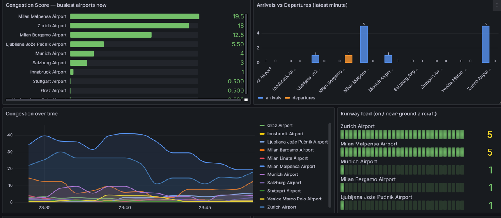

# RealTime Airport Congestion and Traffic Flow Analytics

Individual project for Real-Time Big Data Processing, Free University of Bozen-Bolzano, June 2026· 
Full report: docs/real_time_report.pdf

An end-to-end streaming pipeline that monitors live aircraft activity around major
airports in the Alpine Europe region. Live aircraft positions are ingested from the
OpenSky Network, processed with Apache Flink, stored in PostgreSQL, and visualised on
live Grafana dashboards (congestion score, arrivals/departures, holding-pattern
detection, a regional heatmap, and more).



## Technologies

Docker Compose, Apache Kafka, Kafka Connect, PyFlink, PostgreSQL, Grafana


## Architecture (at a glance)

%20(2).png)

For each aircraft, the PyFlink job assigns it to its nearest airport (Haversine distance, 50 km radius), classifies its behaviour (inbound, outbound, holding, runway activity), and aggregates per-airport metrics over one-minute tumbling windows. The static aircraft metadata (type and operator) is not streamed. It is loaded once into a PostgreSQL table and joined with the live data by Grafana at query time.

## Congestion score

Computed per airport and window:

```
score = 2.0·n_inbound + 1.5·n_outbound + 2.5·n_holding + 1.0·n_runway + 0.5·n_total
```

Holding and inbound aircraft weigh the most, since aircraft converging on or stacked above an airport are the clearest sign of pressure. The weights are configurable and were chosen empirically, not derived from operational data. The score is an informative estimate based on public position data, not an air-traffic-control tool.

.png)

## Prerequisites

- **Docker** and **Docker Compose** (Docker Desktop on Windows/Mac).
- That's it — every component runs in a container; nothing else needs to be installed.

## Quick start

From the project root:

```bash
docker compose up -d
```

The first run builds the Flink image and pulls the other images, so it can take a few
minutes. Compose starts the services in dependency order (Kafka, PostgreSQL, etc. become
healthy before the dependent services start). On first start, PostgreSQL automatically
creates its schema and loads the aircraft metadata from `data/registrations.tsv` — no
manual data-loading step is required.

Check everything is up:

```bash
docker compose ps
```

Wait until the core services show `healthy`. `kafka-init` and `flink-job` are one-shot
containers and will show `Exited (0)` — that is expected (they create the topic and
submit the Flink job, then exit).

## Accessing the system

| Service        | URL                     | Credentials (from `.env`)              |
|----------------|-------------------------|----------------------------------------|
| Grafana        | http://localhost:3000   | `GRAFANA_ADMIN_USER` / `..._PASSWORD`  |
| Flink Web UI   | http://localhost:8081   | —                                      |
| pgAdmin        | http://localhost:5050   | `PGADMIN_EMAIL` / `PGADMIN_PASSWORD`   |
| Kafka Connect  | http://localhost:8083   | —                                      |
| PostgreSQL     | localhost:5432          | `POSTGRES_USER` / `POSTGRES_PASSWORD`  |

The dashboard is in Grafana under **Dashboards → Airport Analytics → Airport Congestion
Analytics**. Give it a few minutes of live data before the panels fill in (metrics are
aggregated over one-minute windows).

## Configuration

All configuration lives in `.env` (read automatically by Docker Compose). The values that
matter most:

- `BBOX_LAMIN / LAMAX / LOMIN / LOMAX` — the geographic bounding box polled from OpenSky.
- `OPENSKY_API_INTERVAL` — polling interval in seconds (default `60`).

The airports tracked by the Flink job are defined in `flink/flink_job.py` (`AIRPORTS`),
and should sit inside the bounding box.

## A note on the OpenSky rate limit

The pipeline uses OpenSky's **anonymous** access, which is rate-limited by a daily credit
budget charged in proportion to the queried area. A large bounding box or frequent polling
can exhaust the budget and return `429 Too Many Requests`, which pauses ingestion. If the
dashboards stop receiving new data:

- Check the connector logs: `docker logs kafka-connect --tail 20` (look for `429`).
- If rate-limited, stop the connector to let the budget recover:
  `docker compose stop kafka-connect`, wait, then `docker compose start kafka-connect`.
- A smaller bounding box and a longer `OPENSKY_API_INTERVAL` make the budget last longer.

The pipeline itself (Kafka → Flink → PostgreSQL → Grafana) keeps running regardless; only
the inflow of new live data depends on OpenSky.

## Design decisions and lessons learned

- **Metadata join moved out of Flink.** The first version joined about 500,000 aircraft records with the live stream inside Flink, which overwhelmed the job. Loading the static table into PostgreSQL and joining at query time kept the streaming job small and fast.
- **Docker from the start.** Running PyFlink locally on Windows caused dependency conflicts, so the whole stack is containerised and reproducible with one command.
- **Configuration as code.** The database schema and the Grafana data source and dashboard are provisioned from files, so the system can be rebuilt from scratch.
- **Idempotent writes.** Flink writes to PostgreSQL with upserts (`INSERT ... ON CONFLICT DO UPDATE`), so a job restart doesn't create duplicates.

## Limitations and possible improvements

- Anonymous OpenSky access is rate-limited because the Kafka Connect source connector does not support OpenSky's OAuth2 login. A small token-fetching component would allow authenticated, higher limits.
- Holding detection uses a single-snapshot approximation. A stateful Flink operator with timers and a circling heuristic would reduce false positives.
- Windows use processing time. Event-time windows with watermarks would be more accurate under delays.
- Missing: periodic cleanup of per-aircraft tables and alerting when congestion crosses a threshold.

## Project layout

```
.
├── docker-compose.yml          # the whole stack
├── .env                        # configuration (credentials, bounding box, interval)
├── data/
│   └── registrations.tsv       # static aircraft metadata (loaded into PostgreSQL)
├── flink/
│   ├── flink_job.py            # the PyFlink stream-processing job
│   ├── kafka_utils.py
│   ├── Dockerfile
│   ├── requirements.txt
│   └── flink-sql-connector-kafka-3.1.0-1.18.jar
├── kafka-connect/
!   ├── kafka-connect-opensky/
!   ├── plugins/
│   ├── entrypoint.sh
│   └── source_state_vectors.json
├── postgres/
│   └── init/                   # *.sql run automatically on first start
│       ├── 01_schema.sql
│       └── 02_aircraft_metadata.sql
├── grafana/
│   └── provisioning/           # datasource + dashboard (provisioned automatically)
```

## Stopping

```bash
docker compose stop      # pause everything (data is preserved)
docker compose start     # resume
docker compose down      # remove containers (named volumes / data preserved)
```

Do **not** use `docker compose down -v` unless you intend to wipe all stored data — that
deletes the PostgreSQL and Grafana volumes, after which the next `up` reloads the schema
and metadata from scratch.

## Credits

The OpenSky source connector in `kafka-connect/` was taken from the course labs (Real-Time Big Data Processing) and is used here unmodified. Flight data comes from the [OpenSky Network](https://opensky-network.org); aircraft metadata from the OpenSky aircraft database.


